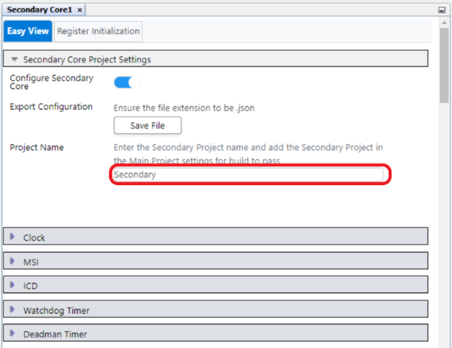
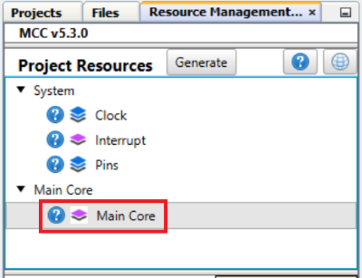
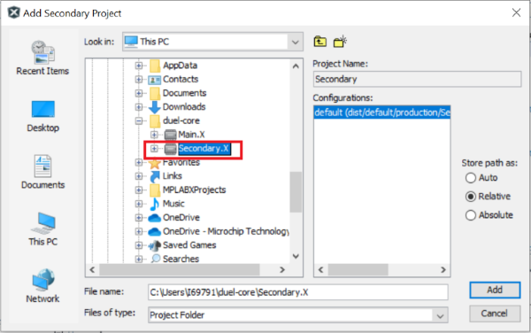
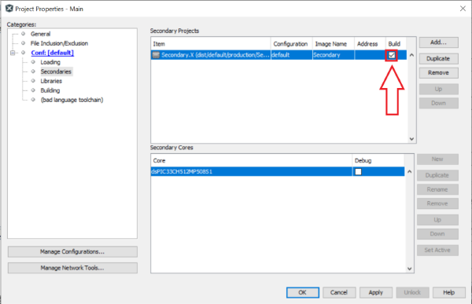

 

## dsPIC33CH Curiosity MSI Mailbox Demo

## Summary

This demo illustrates the process involved in using MPLAB® Code Configurator (MCC) to configure 
the System, MSI module for Mailbox data transfer between Main and Secondary Core, Output pins ownership in a Main project, and the Secondary project of a 
dual-core device.

## Related Documentation

[dsPIC33CH512MP508 datasheet](https://www.microchip.com/dsPIC33CH512MP508) for more information or specifications

## Software Used

- [MPLAB® X IDE v6.10](https://www.microchip.com/mplabx) or newer
- [MPLAB® XC16 v2.10](https://www.microchip.com/xc16) or newer
- Device Family Pack : dsPIC33CH-MP_DFP v1.15.367
- [MPLAB® Code Configurator (MCC) 5.3.7](https://www.microchip.com/mcc) or newer

## Hardware Used

- [dsPIC33CH Curiosity Board](https://www.microchip.com/en-us/development-tool/dm330028-2)

## Setup

**Hardware Setup**

- Connect a micro-USB cable to port `J7` of the Curiosity board to the USB port of a PC.

**MPLAB® X IDE Setup**

- Open the `main.X` project in MPLAB® X IDE.
- Build and program the device.

## Procedure

- Start MCC in the Main core's MPLAB® X IDE project for the dsPIC33CH512MP508 device.
- Set up the configuration for MSI, Output pin ownership in the Main project and export the settings.
    - Configure the MSI mailbox to transfer one word of data from the Main  core to the Secondary core.
    - Configure the MSI mailbox to receive one word of data from the Secondary core to the Main core.
    - Assign an output pin ownership to the Secondary core.
    - Generate the code for main device, Copy main.c file into the project
- Start MCC in the Secondary Project for dsPIC33CH512MP508S1.
- Import the settings from the Main project into the Secondary project.
- Generate the code for secondary device, Copy main.c file into the project.
- Include Secondary project in a Main project.
- Build the Main Project and Program the device.

## Operation

- The demo code transmits data 0xAAAA from the Main core to the Secondary core using MSI, 
  retransmit the received data at the Secondary core to the Main core, Flashes an LED on data match at the Main core,
  followed by flashing an LED at valid data reception at the Secondary core.

## MCC settings for reference

The following sections provide procedures to configure the Main project and the Secondary project using MCC.
 
**Configuring the Main project**

- Create an MPLAB X IDE project with the dsPIC33CH128MP508 device and name the project "Main"
- Load MCC
- Under Project Resources → Click on Secondary Core1 

- Switch to the Secondary Core1 module UI.
- Enable Configure Secondary Core.

- Enter the Secondary project name as "Secondary". 

- In the MSI settings:
    - Enable Protocol A and change the direction to M->S.
    - Enable Protocol B. 
    
- Under Pins Grid View select RE0 as GPIO output 

- In Secondary Core UI assign Output pin ownership for RE1 to Secondary Core1. 

- Under Pins view -> change custom name of RE0 as "LED_Main".

- To export the settings, click on the Save File button. The settings are saved in the MainCoreConfig.json file, which resides in the selected file path while saving config file.

- Generate the code

**Configuring the Secondary project**

- Create an MPLAB X IDE project with the dsPIC33CH128MP508S1 device and name the project "Secondary"
- Load MCC
- Under Project Resources -> Click on Main Core

- Switch to the Main Core module UI
- To import the settings, click on the Load File button in the Main Core. The settings are saved in the MainCoreConfig.JSON file, which resides in the file path which has been considered at the time of export configurations. Select the file for import.

- Upon Import, All MSI Protocol settings related to the Secondary core that were configured in the Main project gets updated to the Secondary project.

- Under Pins Grid View -> select RE1 as GPIO output 

- Under Pins view -> change custom name of RE1 as "LED_Secondary". 

- Generate the code

**Including the Secondary project in the Main Project**

- In the Main project, select Secondaries in the folder listing. Right-click and select Add Secondary Project…. 

- Browse to the Secondary project location and select the Secondary.X image. 

- In the Main project, select Secondaries in the folders list. Right-click to change the properties. Select the Build checkbox. 

- Build the Main Project and Program